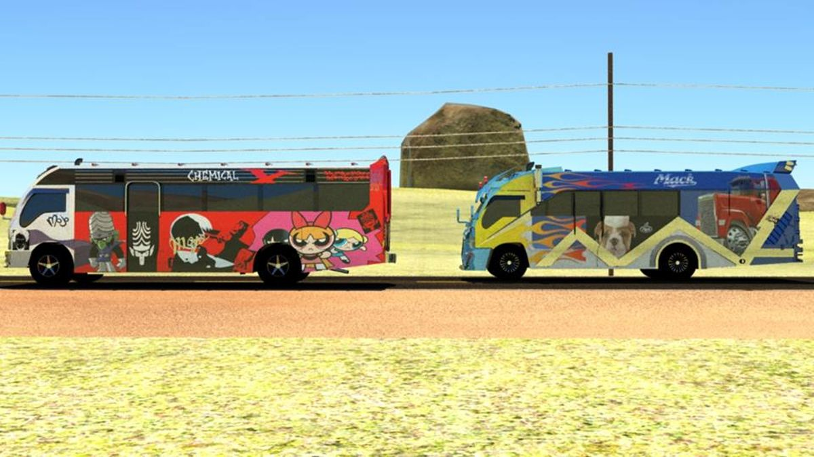

# 🚍 Express Bus Services

[](https://www.php.net/)
[](https://developer.mozilla.org/en-US/docs/Web/JavaScript)
[](https://www.mysql.com/)
[](https://developer.mozilla.org/en-US/docs/Web/HTML)
[](https://developer.mozilla.org/en-US/docs/Web/CSS)

> A modern, user-friendly web application for booking bus tickets across Kenya with secure M-Pesa payment integration.



## 📋 Table of Contents

- [Overview](#-overview)
- [Features](#-features)
- [Demo](#-demo)
- [Technologies](#-technologies)
- [Installation](#-installation)
- [Project Structure](#-project-structure)
- [Usage Guide](#-usage-guide)
- [API Documentation](#-api-documentation)
- [Troubleshooting](#-troubleshooting)
- [Development](#-development)
- [Roadmap](#-roadmap)
- [Contributing](#-contributing)
- [License](#-license)
- [Contact](#-contact)

## 🌟 Overview

Express Bus Services is a comprehensive web application designed to revolutionize the bus ticket booking experience in Kenya. The platform offers a seamless interface for viewing bus schedules, booking tickets, and managing travel information, all with secure payment processing through M-Pesa integration.

## ✨ Features

- **Interactive Bus Schedules**: Browse and search through various routes across Kenya with real-time availability
- **Secure Ticket Booking**: Simple booking flow with email confirmation and receipt generation
- **User Authentication**: Create an account to manage your bookings and view travel history
- **Responsive Design**: Optimized user experience across desktop, tablet, and mobile devices
- **M-Pesa Integration**: Secure and convenient payment processing using Kenya's popular mobile money service
- **Contact System**: Direct communication channel with customer support
- **Admin Dashboard**: Route management and booking oversight (for administrators)

## 🎬 Demo

### Screenshots

*Coming soon*

### Live Demo

*Coming soon*

## 🔧 Technologies

### Frontend
- HTML5, CSS3, JavaScript
- Responsive design principles
- Form validation

### Backend
- PHP 7.4+
- MySQL database
- PHPMailer for email functionality
- FPDF for PDF receipt generation

### Payment Processing
- M-Pesa API integration

## 💻 Installation

### Prerequisites

- Web Server: [XAMPP](https://www.apachefriends.org/index.html), [WAMP](https://www.wampserver.com/en/), or any PHP-supported server
- [Composer](https://getcomposer.org/) for dependency management
- [Git](https://git-scm.com/) for version control
- PHP 7.4 or higher
- MySQL 5.7 or higher

### Step-by-Step Setup

1. **Clone the Repository**
   ```bash
   git clone https://github.com/your-username/expressbus.git
   cd expressbus
   ```

2. **Install Dependencies**
   ```bash
   composer install
   ```

3. **Database Configuration**
   - Create a MySQL database named `expressbus`
   - Import the database schema from `bus/database.sql`
   ```bash
   mysql -u username -p expressbus < bus/database.sql
   ```

4. **Environment Setup**
   - Create a `.env` file in the root directory based on the example below:
   ```
   # Database Configuration
   DB_HOST=localhost
   DB_NAME=expressbus
   DB_USER=root
   DB_PASS=your_password

   # Email Configuration
   SMTP_HOST=smtp.gmail.com
   SMTP_PORT=587
   SMTP_USER=your-email@gmail.com
   SMTP_PASS=your-app-password
   SMTP_SECURE=tls

   # M-Pesa API Configuration
   MPESA_CONSUMER_KEY=your_consumer_key
   MPESA_CONSUMER_SECRET=your_consumer_secret
   MPESA_SHORTCODE=your_shortcode
   MPESA_PASSKEY=your_passkey
   MPESA_CALLBACK_URL=your_callback_url
   ```

5. **Web Server Configuration**
   - Place the project in your web server's document root (e.g., `htdocs` for XAMPP)
   - Configure your web server to point to the project directory

6. **Launch the Application**
   - Start your web server (Apache and MySQL)
   - Navigate to `http://localhost/expressbus` in your browser

## 📁 Project Structure

```
expressbus/
├── assets/                   # Images and static assets
│   └── bus1.jpg              # Bus image used in the UI
├── bus/                      # Main application directory
│   ├── add_route.html        # Admin interface for adding routes
│   ├── booking.html          # Ticket booking interface
│   ├── booking.js            # Booking page JavaScript
│   ├── contact.html          # Contact form
│   ├── contact.js            # Contact form JavaScript
│   ├── contact.php           # Contact form backend
│   ├── database.sql          # Database schema
│   ├── db.php                # Database connection
│   ├── index.html            # Homepage
│   ├── login.html            # User login
│   ├── register.html         # User registration
│   ├── schedules.html        # Bus schedules
│   ├── script.js             # Main JavaScript file
│   ├── send-receipt.php      # Email receipt generation
│   └── styles.css            # Main stylesheet
├── vendor/                   # Composer dependencies
│   ├── phpmailer/            # Email functionality
│   ├── setasign/fpdf/        # PDF generation
│   └── ...                   # Other dependencies
├── composer.json             # Composer configuration
├── composer.lock             # Composer lock file
└── README.md                 # Project documentation
```

## 📘 Usage Guide

### For Passengers

1. **Browse Schedules**
   - Visit the "Schedules" page
   - Use filters to find routes by origin, destination, and date
   - View available seats and pricing

2. **Book a Ticket**
   - Select your desired route from the schedules
   - Fill in passenger details
   - Choose seat preferences (when available)
   - Proceed to payment

3. **Make Payment**
   - Select M-Pesa as your payment method
   - Enter your phone number
   - Confirm payment on your mobile device
   - Receive booking confirmation and e-ticket

4. **Manage Bookings**
   - Create an account or log in
   - View your booking history
   - Download or print e-tickets
   - Cancel or modify bookings (subject to policy)

### For Administrators

1. **Manage Routes**
   - Add new routes with the add_route.html interface
   - Update schedules and pricing
   - Monitor seat availability

2. **View Bookings**
   - Access the admin dashboard
   - View all bookings and filter by date, route, or status
   - Generate reports

## 📡 API Documentation

### M-Pesa Integration

The application integrates with M-Pesa's STK Push API for seamless payment processing.

#### Payment Flow

1. User initiates payment from the booking page
2. System sends STK Push request to M-Pesa
3. User receives payment prompt on their phone
4. User enters M-Pesa PIN to authorize payment
5. M-Pesa processes the transaction and sends callback
6. System validates the payment and confirms booking

## 🔍 Troubleshooting

### Common Issues and Solutions

1. **Email Configuration**
   - **Issue**: Emails not being sent
   - **Solution**:
     - Verify SMTP credentials in your `.env` file
     - For Gmail, use App Passwords instead of regular password
     - Check server firewall settings for SMTP ports

2. **Database Connection**
   - **Issue**: "Could not connect to database" error
   - **Solution**:
     - Confirm database credentials in `.env`
     - Ensure MySQL service is running
     - Check database user permissions

3. **M-Pesa Integration**
   - **Issue**: Payment not being processed
   - **Solution**:
     - Verify M-Pesa API credentials
     - Ensure callback URL is publicly accessible
     - Check transaction logs for error messages

4. **Page Loading Issues**
   - **Issue**: Blank or broken pages
   - **Solution**:
     - Check browser console for JavaScript errors
     - Verify file permissions on the server
     - Clear browser cache and cookies

## 👨‍💻 Development

### Coding Standards

- Follow PSR-12 coding standards for PHP
- Use meaningful variable and function names
- Comment your code appropriately
- Keep functions small and focused on a single task

### Testing

- Test all features across multiple browsers
- Verify mobile responsiveness
- Test payment flow with M-Pesa sandbox

### Version Control

- Use descriptive commit messages
- Create feature branches for new functionality
- Submit pull requests for code review

## 🚀 Roadmap

- [ ] Implement real-time seat selection
- [ ] Add alternative payment methods
- [ ] Develop a mobile application
- [ ] Integrate with SMS notification service
- [ ] Add multi-language support
- [ ] Implement booking analytics dashboard

## 🤝 Contributing

We welcome contributions to improve Express Bus Services! Here's how you can help:

1. Fork the repository
2. Create a feature branch (`git checkout -b feature/amazing-feature`)
3. Commit your changes (`git commit -m 'Add some amazing feature'`)
4. Push to the branch (`git push origin feature/amazing-feature`)
5. Open a Pull Request

Please ensure your code follows our coding standards and includes appropriate documentation.

## 📄 License

This project is licensed under the MIT License - see the `LICENSE` file for details.

## 📞 Contact

For support, feedback, or inquiries:

- **Email**: jndereba3.com
- **Phone**: +254 793643966


---

<p align="center">Thank you for using Express Bus Services! 🚍</p>
